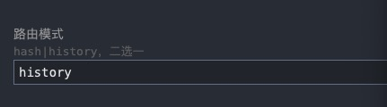
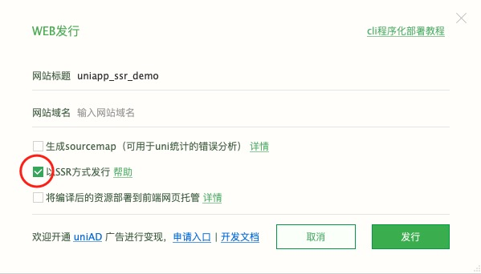

# uniapp_ssr_demo for  <a href="https://uniapp.dcloud.net.cn">uniapp</a>
### 用途：实现搜索引擎seo优化提高排名。将项目转为静态内容。<br><br>这是一个演示uniapp如何实现ssr服务器渲染<br><br>不使用uniapp官方指定的云函数来实现

`uniapp_ssr_demo` 是解决 [uniapp](https://uniapp.dcloud.net.cn) 项目ssr(服务器端渲染),实现seo的解决方案。
<br>官方提供了[ssr解决方案](https://doc.dcloud.net.cn/uni-app-x/web/ssr.html) 截止发稿前必须要使用uniCloud 云函数。
<br>这是实现uniCloud不需要云函数解决方案。


## 安装

```sh
npm install
```

**Note:** 关键是需要安装最新的 @dcloudio/uni-app 及 @dcloudio/uni-h5。 <br>
以后出现版本不兼容的情况 [这里查询](https://github.com/dcloudio/uni-app/tags) 最新版本号
在package.json修改版本号 执行安装


## 设置

### 1.在uniapp设置路由mode   **history**


### 2.发布的时候设置ssr发行 (vue3才支持)


## 复制生成好的client跟server目录到该项目根目录运行

```sh
npm start
```
## seo优化
### 直接在页面里使用
```html
	<!-- #ifdef H5 -->
	<teleport to="head">
		<meta name="description" content="这是一个uniapp_ssr_demo" />
    <meta name="keywords"   content="uniapp_ssr"/>
	</teleport>
	<!-- #endif -->
```
 
## 注意事项
1. 不能有环境代码。详情可以看官方的[说明](https://doc.dcloud.net.cn/uni-app-x/web/ssr.html) 比如 window document 
2. 还有很多api不支持 比如 uni.getSystemInfoSync uni.createSelectorQuery uni.createAnimation
3. 注意链接是否是onclik事件 需要使用navigator
4. 如果有不兼容的代码 会node报错 不会服务器渲染 但不影响网页运行
5. ssr很多代码不兼容 多到让你怀疑人生 做好心里准备。
